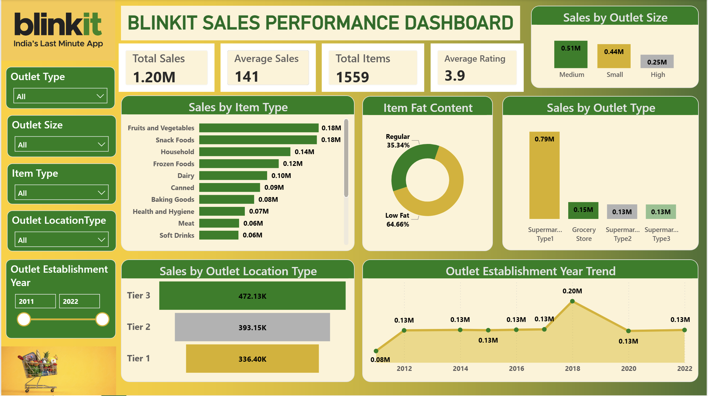

# 🛒 BlinkIT Sales Analysis Dashboard

## 📌 Overview
This project presents an end-to-end data analytics workflow using Python, SQL, and Power BI. The objective was to analyze BlinkIT grocery sales data, uncover business insights, and build an interactive dashboard that helps stakeholders make data-driven decisions.

The project covers data cleaning, exploratory data analysis (EDA), SQL-based analysis, dashboard development, business reporting, and presentation creation.

## 📂 Dataset
The dataset contains grocery sales information, including:
* Product Categories
* Sales
* Outlet Information
* Outlet Location
* Outlet Type
* Item Fat Content
* Customer Ratings
* Item Visibility
* Item Type
* Outlet Establishment Year
* 
The data was cleaned and transformed before analysis to ensure accurate reporting.

##. Reporting & Presentation
* Prepared a business report summarizing key findings.
* Designed a presentation using Gamma to communicate insights effectively.

# 📊 Dashboard Preview

```md


```

---

# 📈 Key Insights

* 💰 **Total Sales** reached approximately **$1.20M**, demonstrating strong overall business performance.

* 🥦 **Fruits & Vegetables** and **Snack Foods** were the highest-selling product categories, indicating strong customer demand for daily essentials.

* 🏪 **Supermarket Type 1** generated the highest revenue among all outlet types, making it the company's best-performing retail format.

* 📍 **Tier 3 outlets** contributed the highest share of sales, suggesting that smaller cities represent a significant growth opportunity.

* 🥗 **Low Fat** products generated higher sales than Regular products, reflecting changing customer preferences toward healthier food choices.

* ⭐ The average customer rating of approximately **3.97/5** indicates a generally positive customer experience.

* 📦 Sales were well distributed across multiple product categories, reducing dependency on a single product segment.


# 💡 Business Recommendations

* Increase inventory for high-performing product categories such as Fruits & Vegetables and Snack Foods.

* Expand marketing campaigns and promotional offers in Tier 3 cities to capitalize on strong customer demand.

* Invest in expanding Supermarket Type 1 outlets due to their superior sales performance.

* Promote Low Fat products through targeted marketing campaigns to leverage growing health-conscious consumer behavior.

* Continue monitoring customer ratings and feedback to further improve customer satisfaction and retention.


# 🎯 Skills Demonstrated
* Data Cleaning
* Exploratory Data Analysis (EDA)
* Python Programming
* SQL Query Writing
* Data Visualization
* Power BI Dashboard Development
* Business Intelligence
* Business Reporting
* Presentation Design


# 🚀 Future Improvements
* Build predictive sales forecasting models.
* Connect Power BI to a live database.
* Automate the ETL pipeline.
* Deploy dashboards for real-time business monitoring.


## 👨‍💻 Author
**Piyush Gupta**
Aspiring Data Analyst passionate about transforming raw data into actionable business insights using Python, SQL, and Power BI.
